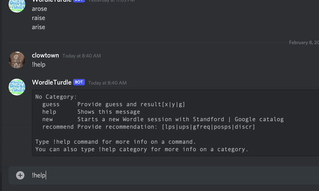

 ╭╮╭╮╭╮╱╱╱╱╱╱╭┳╮╱╱╱╱╭━━━━╮╱╱╱╱╱╭┳╮
 ┃┃┃┃┃┃╱╱╱╱╱╱┃┃┃╱╱╱╱┃╭╮╭╮┃╱╱╱╱╱┃┃┃
 ┃┃┃┃┃┣━━┳━┳━╯┃┃╭━━╮╰╯┃┃┣┫╭┳━┳━╯┃┃╭━━╮
 ┃╰╯╰╯┃╭╮┃╭┫╭╮┃┃┃┃━┫╱╱┃┃┃┃┃┃╭┫╭╮┃┃┃┃━┫
 ╰╮╭╮╭┫╰╯┃┃┃╰╯┃╰┫┃━┫╱╱┃┃┃╰╯┃┃┃╰╯┃╰┫┃━┫
 ╱╰╯╰╯╰━━┻╯╰━━┻━┻━━╯╱╱╰╯╰━━┻╯╰━━┻━┻━━╯

 # Bot invite to server
 https://discord.com/oauth2/authorize?client_id=%20937179925511806998&scope=bot

 # Interact
 <!-- thanks to https://ezgif.com for the gif -->
 

## developer setup:
> install pyenv, virtualenv
>
> pyenv virtualenv 3.9.4 wordle
>
> pyenv activate wordle
>
> pip install --upgrade pip
>
> pip install -r requirements.txt
>
> add discord token to .env file
>
> .env file contents: DISCORD_TOKEN={your token}